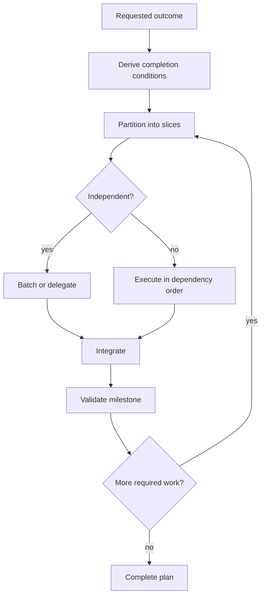

# Workflow Rules

## Deterministic slicing

A slice should have:

- one concrete outcome;
- known inputs or a clear discovery step;
- a bounded change surface;
- a verification signal.

Prefer slices such as `inspect -> implement -> validate` over file-by-file task
lists.

## Dependency routing

Batch commands whose arguments are already known and whose outputs do not
determine each other's inputs. Do not blindly chain with `&&` when individual
failure handling matters.

## Validation cadence

Validate after coherent work, not every edit. Start focused, broaden only when
the risk or repository workflow justifies it. Do not rerun a successful check
without a relevant change or new concern.

## Failure transitions

When validation fails, decide whether the failure invalidates the
implementation, the plan, or neither. Repair an implementation defect within
the current slice. Revise future slices only when evidence changes dependencies
or scope. Report an unrelated baseline failure instead of absorbing it into the
task.

A valid completion record names the changed outcome and the check that
distinguishes it from the incorrect behavior. File existence, a rewritten plan,
or a worker's success claim is not sufficient by itself.

## Delegation handoff

Delegate only when a slice is substantial, bounded, and can replace root work.
Provide the child the objective, scope, authoritative paths/symbols, expected
output, and stop condition. The root integrates rather than repeats the work.
