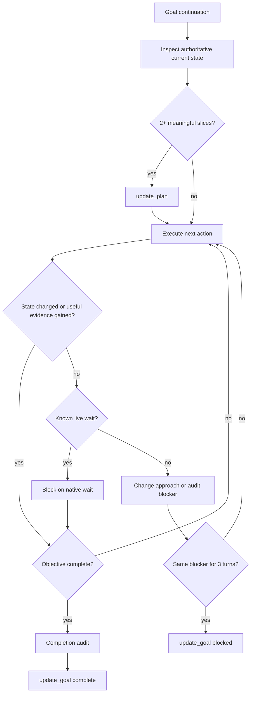

# Continuation Discipline

Treat the worktree, process/job handles, tests, remote state, and current
artifacts as authoritative. Conversation history is navigation context, not
proof of completion.

## Continuation audit

Before ending a continuation, identify which authoritative state changed. If
none changed, the turn must have produced evidence that selects a different next
action, entered a blocking wait, or advanced the consecutive-blocker audit. A
goal status read, plan rewrite, or repeated diagnostic with identical output
does not qualify.

After a resumed blocked goal, reset the consecutive-blocker count. After
compaction, verify the checkpoint against current artifacts rather than
replaying completed actions.
