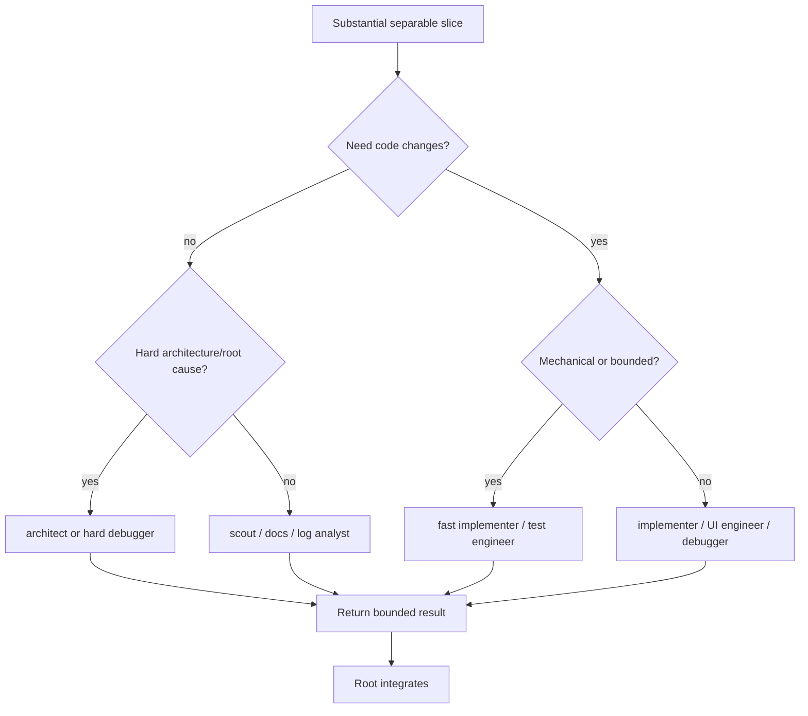

# Agent Routing

Choose the cheapest role that can reliably replace root work.

Use reviewer after implementation when independent defect-finding is worth the
extra turn. Do not delegate merely to parallelize trivial work.

Never use Astra as a root coordinator.

Do not spawn for trivial work, tightly coupled steps, or tasks whose context
costs more to specify than the work itself. Do not use a reviewer as a
supervisor or a worker to wait on another worker. Prefer parallel children only
when their scopes and writes are independent; otherwise sequence them through
root integration.
